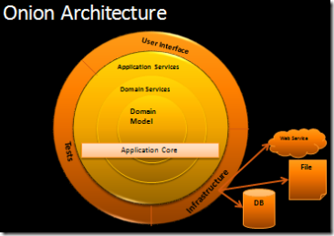

# Onion-Architecture-Pattern-DotNetCore
The “Hello World” program is built on the “Onion Architecture Pattern”, which addresses code decoupling and separation of concerns.  Coupling is towards the core therefore, outer layers depend on layers more central and cannot depend on layers further away from the core.  Furthermore, the pattern relies on Dependency Injection and Inversion of Control.  

Below is a general diagram that depicts the “Onion Architecture Pattern”.

The solution includes the following layers from center to outer: *Domain Model*, *Domain Services*, *Application Services*, *Infrastructure*, *Client (UI)*, *Tests*.  The *Domain Model*, *Domain Services*, and *Application Services* layers make up the *Application Core*.  The *Infrastructure*, *Client (UI)*, and *Tests* layers are the outermost layers and depend on the layers in the *Application Core*.

## Projects in the solution:
###### Domain Model
- **ApplicationCore.Domain.Models:** Contains all domain models

###### Domain Services
- **ApplicationCore.Domain.Interfaces:** Contains infrastructure interfaces that abstract infrastructure

###### Application Services
- **ApplicationCore.Services.Interfaces:** Contain service interfaces that abstract the API and entry point to the domain

- **ApplicationCore.Services:** Concrete implementation of service interfaces that handle data validation and business logic

###### Infrastructure
- **Infrastructure.Repositories:** Concrete implementation of infrastructure interfaces where specific technologies are consumed such as Entity Framework, Dapper, and NoSQL

###### Client (UI)
- **Clients.ConsoleApplication:** Program logic that consumes API services

###### Tests
- **Tests.Services.Tests:** Unit tests to support the API

###### Utilities
- **Utilities.DI.Modules:** Inversion of control modules used for dependency injection